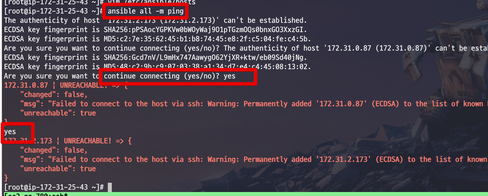

# 1. 앤서블 설치 및 호스트 서버들 연결하기

개인적으로 새로운 기술은 배우는데 있어 책을 보는 것은 학습에 도움이 되지 않았습니다.  
  
항상 **그 기술이 필요해서 무엇이든 실용적인걸 만들때** 빠르게 습득할 수 있었습니다.  
  
그래서 앤서블 역시 제가 필요한 도구를 만들면서 익혀보려 합니다.  
이 과정은 어디까지나 **IDC 환경에서 어떻게 인프라 작업**을 쉽게 할 것인지가 주 초점입니다.
즉, **클라우드 못쓰는 상황이라는 가정**하에 진행합니다.

> 그래도 실습 환경은 AWS EC2를 사용합니다 ㅠ  물리장비가 없어서 ㅠ 테라폼 / 오픈스택 / 클라우드포메이션 뿐만 아니라 **호스트 서버들은 인터넷도 안되는 상황**이라고 가정합니다.

IDC 인프라에서 정말 필요하면서도 귀찮은 작업인 **전체 서버에 신규 서버 계정 추가하기**를 앤서블로 해결합니다.  
  
아래는 이번 커리큘럼 목차입니다.

1. 앤서블 설치 및 호스트 서버들 연결하기
2. 앤서블 CLI로 사용자 추가하기
3. 플레이북으로 사용자 개선하기
4. 젠킨스 & 깃허브 & 플레이북로 개선하기

자 그럼 한번 시작해보겠습니다.

## 1-1. 환경 소개

* AWS의 EC2 3대로 진행합니다.
  * Amazon Linux 1을 사용합니다.
    * 현재 팀내 IDC 인프라가 Centos6 이라서 그에 맞춰 진행합니다.
    * VMWare나 베이그런트, 도커 등을 사용한다면 Centos 6 버전 설치하시면 됩니다.
  * EC2 1대는 앤서블의 서버로
  * 나머지 2대는 앤서블의 호스트로
  * 서버와 호스트간에는 서로 연결될 수 있어야 합니다.
    * EC2 를 쓰신다면 [이전 포스팅](https://jojoldu.tistory.com/430)을 참고하셔서 포트를 열어주세요.
* 도커, VMWare 등 다른 가상 컨테이너들을 사용해 구성해도 무방합니다.
* 앤서블 서버 -> 호스트로는 접근이 되어야 합니다.

뭐가 됐든 3대의 서버만 있으시면 됩니다.

## 1-2. 왜 앤서블?

이미 잘 운영되고 있는 서버들에 **동일한 명령어를 수행해야 할 때가 있습니다**.

* 신규 입사자를 위한 서버 계정 생성
  * 클라우드에서는 ec2-user로 다 통일해서 쓰는 경우가 있는데 IDC 정책상 개발자마다 서버 계정 발급 받아 써야하는 경우가 많습니다.
* 기존 사용자의 비밀번호 변경
* 기존 사용자의 Sudo 권한 제거

등등 흔히 말하는 **짜치는 업무**들이 생각보다 자주 필요합니다.  
이런 일이 수십대, 수백대 서버에 필요하다고 하면 그날부터 노가다 시작입니다.  

이걸 해결하기 위해 쉘 스크립트를 이용해 전체 서버에 명령을 수행하기도 합니다.  
  
다만, 이렇게 되면 쉘 스크립트를 잘 모르시는 분들껜 하나의 허들이 될 수 있고, **작성한 사람만 수정할 경우가 많습니다**.  
  
**전체 서버에 동일한 명령어**를 안정적으로 수행하고 **이력 관리**가 되는게 필요하면 도구의 힘을 빌리는게 편합니다.  
  
이런 도구를 Infrastructure as Code 라고 부르며 앤서블과 더불어 Puppet, Chef, Salt 등이 있습니다.  
이 중에서 앤서블을 선택한 이유는 다음과 같습니다.

* 에이전트 설치가 필요 없습니다.
  * Puppet, Chef는 각 호스트에 에이전트가 꼭 설치되어있어야 합니다.
  * Salt는 선택 사항입니다.
* 문법이 YAML 이라 익히기 쉽습니다.
  * 다른 도구들의 경우 자체 DSL을 사용하는데 앤서블의 경우 DSL을 쓰지 않고 YAML로만 사용 합니다.
  * 그만큼 러닝 커브 (학습 곡선)이 낮습니다. (시간 투자 대비 얻는 지식이 많습니다.)
* 국내 자료가 가장 많습니다.
  * 서점에 가서 검색해보시면 다른 기술들에 비해 앤서블 책이 압도적으로 많습니다.

이런 이유로 앤서블을 선택했습니다.  

자 그럼 앤서블 실습을 시작해보겠습니다.

## 1-3. 앤서블 설치

앤서블 서버 (호스트에 명령을 주는 서버)로 접속하셔서 앤서블을 설치합니다.  
  
EC2 서버에 접속하시면 기본 계정이 ec2-user이기 때문에 먼저 root 계정으로 변경합니다.

```bash
sudo su - root
```

여기서는 yum을 통해 설치하지 않고 ```pip```를 통해 설치하겠습니다.  
리눅스에서는 기본적으로 파이선2와 ```pip```가 설치되어 있으니 pip로 설치합니다.

```bash
pip install ansible
```

yum 설치가 아닌 pip로 설치한 이유는 다음과 같습니다.

* 어떤 OS환경에서도 같은 방식으로 가능합니다.
* 모듈에 따라 필요한 의존 패키지들 설치가 편합니다.
* **개발 버전**도 설치 가능합니다.

apt-get, yum, exe 설치 등 관계 없이 일관된 방법으로 설치가 가능하니 ```pip```로 설치해서 진행하시면 편합니다.  
  
설치가 다 되셨다면 간단한 명령어로 확인합니다.

```bash
ansible -h
```


그리고 명령어를 한번 수행해봅니다.

```bash
ansible localhost -m ping
```


여기까지 확인되셨다면 설치가 성공적으로 되신겁니다.  
앤서블 서버 설정이 다 되었으니 호스트들을 등록하겠습니다.

## 1-4. 호스트 등록
  
앤서블은 ```/etc/ansible/hosts``` 에 있는 호스트 정보를 기본적으로 읽어갑니다.  
  
그래서 아래와 같이 ```/etc/ansible/hosts```을 열어 호스트 정보를 등록합니다.

```bash
vim /etc/ansible/hosts
```

등록 방법은 아래처럼 사용하면 됩니다.

```bash
[web]
호스트IP1
호스트IP2
```


* ```[web]```
  * 바로 아래 호스트를 나타내는 **그룹명**입니다.
  * 호스트들을 묶어서 사용할때 필요한 이름입니다.
  * 실제로 특별히 하는 기능은 없으니 본인이 원하는 이름으로 지으시면 됩니다.

다 등록 되셨다면 호스트로 접근이 되는지 한번 테스트 해봅니다.

```bash
ansible all -m ping
```

그럼 아래와 같이 처음으로 ssh 접속에 대한 메세지가 보입니다.  
해결책은 ```yes```를 입력하는 것입니다.



yes는 **호스트 서버 숫자만큼** 입력합니다.  
  
단, 이렇게 해도 다시 ping을 수행하면 **접근 권한이 없다는 에러**가 발생합니다.  
  
그래서 앤서블 서버 -> 호스트로 접근할 수 있게 권한을 추가하겠습니다.

### id_rsa 생성 및 등록

호스트에 접속 가능한 계정을 생성해도 되지만, 간편하게 접근하기 위해 id_rsa 키를 생성해서 접근하겠습니다.  

> ssh id_rsa에 대한 자세한 내용은 [생활코딩 강좌](https://opentutorials.org/module/432/3742) 를 참고하세요.

먼저 앤서블 서버 (호스트 아닙니다) 의 ```.ssh``` 로 이동합니다.  
(root 계정입니다.)  
  
```bash
cd ~/.ssh
```

아래 명령어를 수행해 키를 생성합니다.

```bash
ssh-keygen -t rsa
```


* id_rsa
  * private key
  * 절대로 타인에게 노출되면 안된다.
* id_rsa.pub
  * public key
  * 접속하려는 리모트 머신의 authorized_keys에 입력한다.

이렇게 생성된 키를 사용하기 위해 아래 명령어를 차례로 입력하여 권한을 변경합니다.

```bash
chmod 700 /root/.ssh
chmod 600 /root/.ssh/id_rsa
chmod 644 /root/.ssh/id_rsa.pub
chmod 644 /root/.ssh/authorized_keys
chmod 644 /root/.ssh/known_hosts
```

여기서 생성된 키 중 id_rsa.pub는 **접속할 서버인 호스트**에 등록되있어야 합니다.  
  
그래서 id_rsa.pub 코드를 복사하여 **각각의 호스트**에 위치한 ```/home/ec2-user/.ssh/authorized_keys``` 파일에 **앤서블 서버의 id_rsa.pub** 코드를 추가합니다.  
  
아래 명령어를 각각의 서버에서 실행합니다.

**앤서블서버**

```bash
cat id_rsa.pub
```

여기서 나온 코드를 복사하여 호스트에 붙여넣습니다.  
  
**호스트**  

```bash
vim /home/ec2-user/.ssh/authorized_keys
```

아래와 같이 붙여 넣으시면 됩니다.


* ```/home/ec2-user/.ssh/authorized_keys```
  * 기본적으로 ec2 인스턴스의 계정이 ec2-user라서 ec2-user의 authorized_keys에 붙여넣습니다.
  * 만약 다른 계정에서 진행하고 싶다면 계정을 생성하고 진행하시면 됩니다.

그리고 다시 한번 ping 테스트를 해봅니다.  

## 1-5. 테스트

이번 ping 테스트에서는 하나의 옵션이 추가됩니다.  

```bash
ansible all -m ping -u ec2-user
```

* ```-u ec2-user```
  * **접근할때 사용될 호스트 계정**입니다.
  * id_rsa.pub이 호스트의 ```ec2-user``` 계정에 있기 때문에 해당 계정으로 접근합니다.

명령어를 실행해보시면!


ping이 성공적으로 호스트 전체에 실행된 것을 확인할 수 있습니다.


## 1-6. 마무리

가장 첫번째 과정으로 앤서블 서버와 호스트 서버간에 연결을 해보았습니다.  
다음엔 **앤서블 CLI**로 실제 서버 계정을 각 호스트 서버에 추가하는 과정을 진행해보겠습니다.