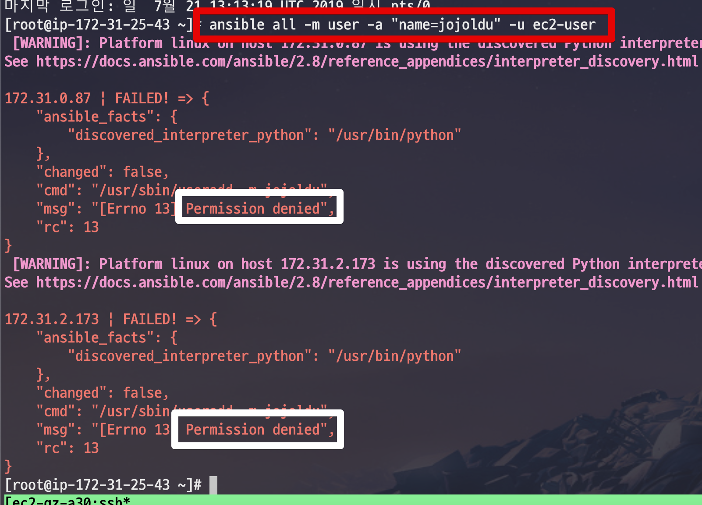
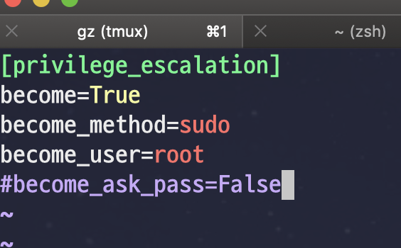
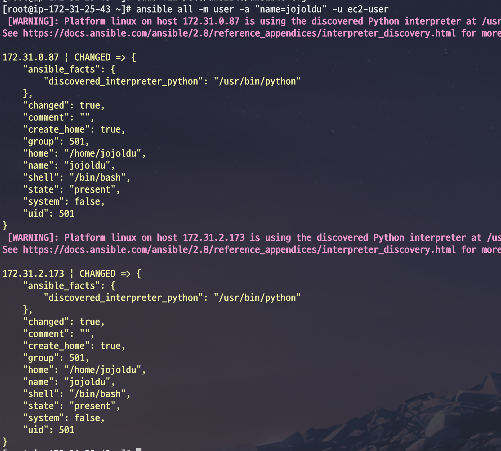
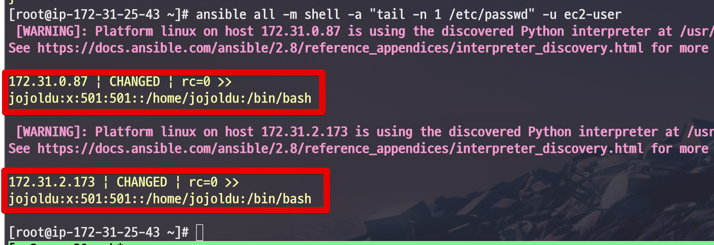
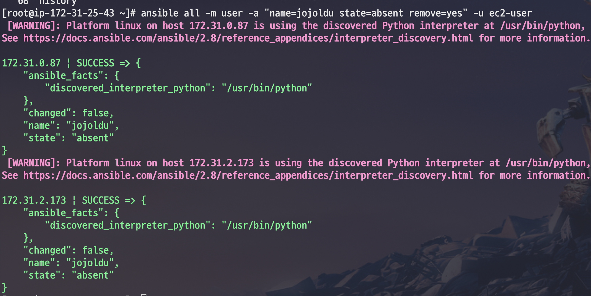
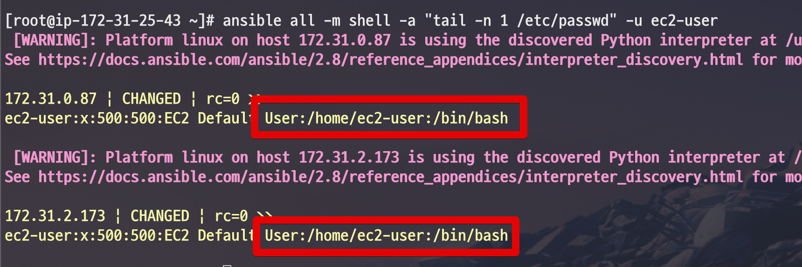
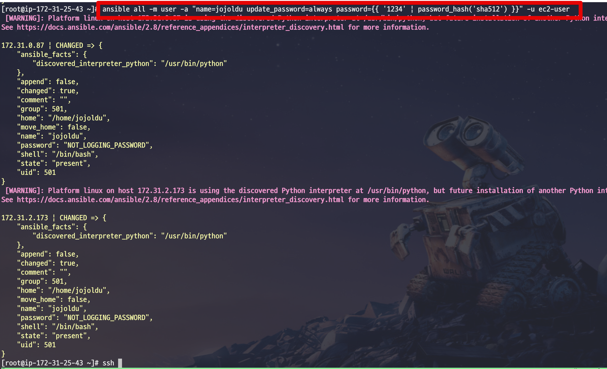
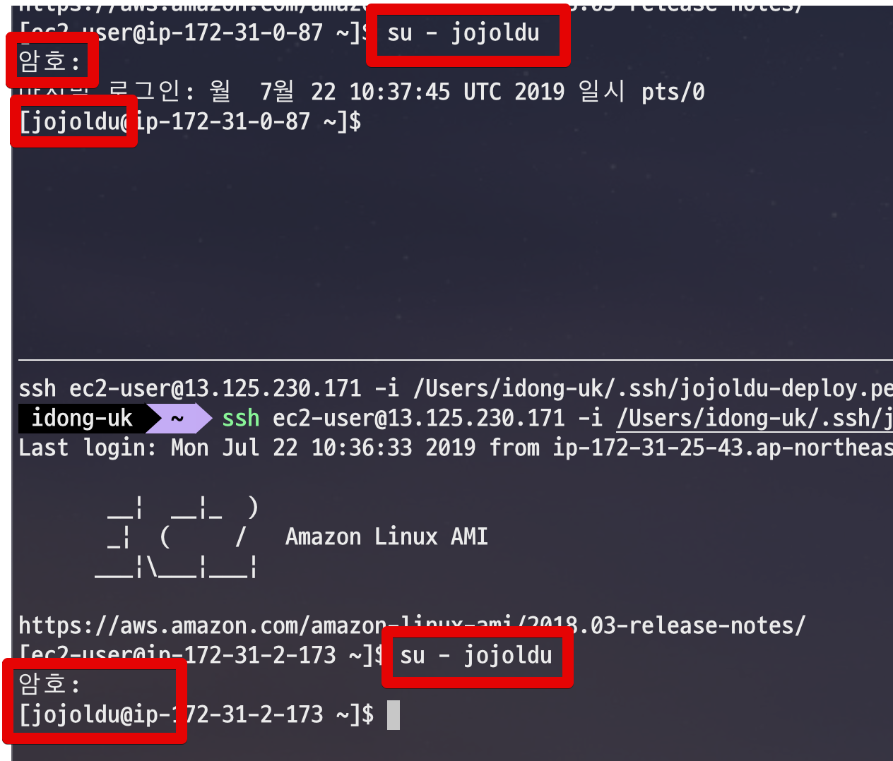
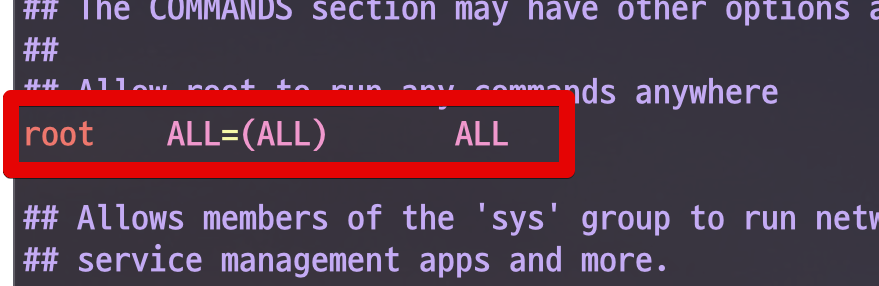

# 2. Ansible (앤서블) 로 전체 서버 계정 추가하기 - CLI로 계정 추가하기

이번 시간엔 앤서블 CLI를 통해 각 호스트에 **루트 권한을 가진 계정을 추가**해보겠습니다.

## 2-1. user 모듈로 계정 추가

ansible에선 ```user```라는 모듈이 계정 추가/삭제 기능을 지원하고 있습니다.  
이 모듈을 사용해서 다음과 같이 명령어를 수행하면 계정이 생성됩니다.  
(**앤서블 서버에선 root계정 상태**입니다.)  
  
```bash
ansible all -m user -a "name=jojoldu" -u ec2-user
```

* ```-m user```
  * 사용할 모듈 (Module) 을 지정합니다.
  * 여기서는 앤서블의 [user](https://docs.ansible.com/ansible/latest/modules/user_module.html) 모듈을 사용합니다. 
* ```-a "name=jojoldu"```
  * user 모듈에 사용될 파라미터를 지정합니다.
  * user 모듈에는 name 이라는 기본 파라미터가 있습니다.
    * 이 name 파라미터가 실제 생성될 계정명을 나타냅니다.
    * ```파라미터=값``` 으로 지정하면 해당 모듈에서 값을 인식해서 사용됩니다.

명령어를 수행하시면 아래와 같이 **권한 거부** 에러가 발생합니다.



이는 현재 호스트 접근 계정인 ec2-user에 ```sudo``` 권한이 없기 때문입니다.  
이를 해결하기 위해 ec2-user가 아닌 **root 계정으로 접근하기엔 부담**스럽습니다.  
  
그래서 명령어를 수행할때마다 ```sudo``` 가 함께 수행될 수 있게 설정값을 추가해보겠습니다.  
  
아래 명령어로 ```ansible.cfg``` 을 열어서

```bash
sudo vim /etc/ansible/ansible.cfg
```

아래와 같이 ```[privilege_escalation]``` 항목을 설정합니다.

```bash
[privilege_escalation]
become=True
become_method=sudo
become_user=root
```



* ansible.cfg은 앤서블의 설정 파일입니다.
* /etc/ansible/ansible.cfg 은 글로벌 설정 파일입니다.
  * 우선 순위가 가장 낮습니다.
  * 이보다 높은 우선 순위는 현재 디렉토리 (```ansible.cfg```), 현재 사용자의 홈 디렉토리 (```~/.ansible.cfg```) 이 있습니다.
  * 글로벌 설정을 피하고 싶다면 위 설정 위치를 사용하시면 됩니다.

설정이 다 되셨다면 다시 명령어를 수행해봅니다.



정상적으로 계정이 생성된 것을 확인할 수 있습니다!  
  
실제로 각 서버에 계정이 추가되었는지 확인도 ansible로 해봅니다.

```bash
ansible all -m shell -a "tail -n 1 /etc/passwd" -u ec2-user
```

그럼 다음과 같이 home 디렉토리에 계정이 추가된 것을 확인할 수 있습니다.




## 2-2. 임의 추가된 계정 삭제하기

다음으로 방금 추가한 계정을 삭제해보겠습니다.  
  
삭제는 간단합니다.  
기존 계정 생성 명령어에 ```state=absent remove=yes``` 만 추가하면 됩니다.

```bash
ansible all -m user -a "name=jojoldu state=absent remove=yes" -u ec2-user
```



다시 삭제되었는지 확인 해봅니다.



더이상 마지막 계정 표기에 jojoldu가 아닌 ```ec2-user```만 노출된다면 정상적으로 삭제 된 것입니다.  
  
테스트로 추가된 계정은 이렇게 삭제하면 되겠죠?

## 2-3. 패스워드 추가하기

자 그럼 계정을 생성하고 해당 계정에 비밀번호를 추가해보겠습니다.  
(기존 계정의 비밀번호 변경도 같은 방법으로 가능합니다.)  
  

[[ad]]

2-2에서 계정을 삭제했다면 다시 같은 계정을 생성해주시고, 삭제하지 않으셨다면 그대로 진행하시면 됩니다.  
  
아래 명령어로 **본인이 원하는 비밀번호**로 변경합니다.

```bash
ansible all -m user -a "name=jojoldu update_password=always password={{ '변경하고싶은 비밀번호' | password_hash('sha512') }}" -u ec2-user
```

저는 간단하게 1234 라는 비밀번호를 사용했습니다.



비밀 번호가 추가되었으면 한번 확인해보겠습니다.  
호스트 서버들에 접속하신뒤 신규 생성 (+비밀번호가 추가된) 계정으로 로그인해봅니다.



> 제가 사용한 ec2 접속기는 [ec2-gauza](https://github.com/leejaycoke/ec2-gazua) 입니다.  
자세한 설치법은 [이전 포스팅](https://jojoldu.tistory.com/311)을 참고해주세요.

로그인이 잘 되신다면 비밀번호가 정상적으로 추가 된 것입니다!

## 2-4. sudo 권한 추가

마지막으로 신규 추가된 계정에 sudo 권한을 추가해보겠습니다.  
  
기본적으로 리눅스의 경우 sudo 권한이 필요할시에 ```/etc/sudoers``` 파일에 계정을 추가해서 사용합니다.  
  


다만, 이 파일이 너무 **크리티컬한 파일**이라서 잘못 수정했다가는 서버를 포맷해야되는 일이 발생할 수 있습니다.  
  
그래서 직접 이 파일을 손대지는 않고, 계정만 안전하게 추가할 수 있는 방법이 있습니다.  
  
바로 ```/etc/sudoers.d/``` 에 계정의 권한을 가진 파일을 추가하는 것입니다.  
  
해당 디렉토리에 포함된 파일이 아래와 같은 양식을 가지면 해당 계정은 ```sudo```를 실행할 수 있습니다.  

```bash
계정명 ALL=(ALL) NOPASSWD:ALL
```

* 여기서 ```NOPASSWD:ALL```은 **sudo 실행시 패스워드를 입력받지 않겠다**는 의미입니다.


```bash
echo 'jojoldu   ALL=(ALL)   NOPASSWD:ALL' > /etc/sudoers.d/jojoldu
```

```bash
ansible all -m shell -a "echo '$USER_NAME   ALL=(ALL)   NOPASSWD:ALL' > /etc/sudoers.d/$USER_NAME" -e "ansible_user=dwlee ansible_ssh_pass=비밀번호"
```

```bash
ansible all -m copy -a "content='jojoldu ALL=(ALL) NOPASSWD: ALL' dest=/etc/sudoers.d/jojoldu mode=0644 validate='/usr/sbin/visudo -c -f \'%s\''"
```

```
      copy:
       content: |
         {{ USER_NAME }} ALL=(ALL) NOPASSWD: ALL
       dest: /etc/sudoers.d/{{ USER_NAME }}
       mode: 0644
       validate: "/usr/sbin/visudo -c -f '%s'"
```

