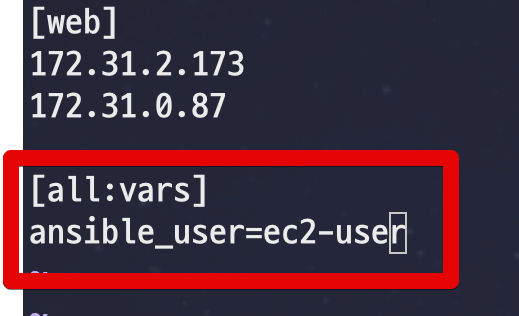

# 3. Ansible (앤서블) 로 전체 서버 사용자 추가하기 - 플레이북으로 개선하기

이번 시간에는 앤서블의 플레이북 (Playbook) 을 통해 그동안 CLI를 하던 방식을 개선해보겠습니다.

> 모든 코드는 [Github](https://github.com/jojoldu/ansible-in-action)에 있습니다.

## 3-1. 플레이북?

앤서블 공식 홈페이지의 [플레이북 소개](https://docs.ansible.com/ansible/latest/user_guide/playbooks.html)를 한번 보겠습니다.

> 플레이북은 앤서블의 설정/배포/오케스트레이션 (역주. 통합자동화/통합솔루션등) 언어 입니다.
호스트서버에서 시행할 정책이나 일반적인 시스템 프로세스의 단계를 설정할 수 있습니다.
만약 앤서블의 모듈이 작업장의 **도구**라면, 플레이북은 **지침서**, 호스트들의 인벤토리는 원재료입니다.

소개글을 살짝만 보더라도 플레이북이란 **앤서블의 명령을 모아놓은 설계서**와 같다는 것을 알 수 있습니다.  

플레이북은 쉘이나 DSL (Domain Specific Language, 특정 도메인에 특화된 언어) 과 같은 프로그래밍 언어로 구성되어있지 않습니다.  

> 다른 Infrastructure as code 도구들은 본인만의 DSL을 사용합니다.

프로그래밍 언어 대신 **YAML**을 사용합니다.  
스프링부트를 사용하시던 분들은 YAML에 친숙합니다.  
만약 처음 들어보신 분들이더라도 쉽게 배울 수 있습니다.  
YAML은 기본적으로 **기계가 파싱하기 쉽게, 사람이 다루기 쉽게**라는 컨셉으로 나온 기술이다보니 그 자체가 어렵지 않습니다.  
  
들여쓰기와 대시 (```-```) 로만 이루어져있기 때문에 러닝커브가 굉장히 낮습니다.  
  
플레이북에 대한 소개는 글로는 한계가 있으니 바로 실습을 통해서 배워보겠습니다.

## 3-2. 플레이북 IDE

일단 플레이북을 편집하기에 좋은 도구가 필요합니다.  
YAML 편집기면 다 가능할것 같지만, 개인적인 생각으론 앤서블 전용 플러그인이 있는 편집기가 작성하기 가장 편했습니다.  
  
앤서블 플러그인을 갖고 있는 IDE는 크게 2가지 종류가 있습니다.  
인텔리제이 기반 IDE들과 일렉트론 기반의 에디터들입니다.  
저는 개인적으론 일렉트론 기반의 VS Code를 추천합니다.  
인텔리제이의 Ansible 플러그인은 사실상 **YAML 문법 체크와 하이라이팅**정도만 지원하고 있습니다.  
자동 완성 등을 지원하지 않으니 VS Code 플러그인을 설치해서 사용하시길 추천합니다.

* [앤서블 플러그인](https://marketplace.visualstudio.com/items?itemName=vscoss.vscode-ansible)

서버에선 보통 GUI 환경이 지원 안되니 개인 PC에서 코드를 작성후 서버에 그대로 붙여넣는 식으로 개발하시면 됩니다.

## 3-3. 플레이북으로 개선

먼저 플레이북을 담고 있을 디렉토리를 생성합니다.  

```bash
mkdir ~/ansible-useradd
```

그리고 해당 디렉토리에 ```site.yml```파일을 생성합니다.  
site.yml이 바로 **플레이북**입니다.

> site.yml은 공식적인 파일명은 아니며, 앤서블의 **관례**로 사용되는 파일명입니다.  
> 대부분의 튜토리얼에서도 site.yml 로 사용합니다.
> 꼭 이 이름으로 써야하는가 라고 하면 그렇진 않습니다.


플레이북의 기본 문법은 아래와 같습니다.

```yaml
---
- name: 플레이이름
  hosts: 대상호스트서버들
  task:
    - name:
      모듈:
        모듈내명령어:
```

* ```---```
  * YAML 파일임을 명시합니다. 
* ```-name:```
  * 플레이 이름
  * 필수는 아니지만, 화면 출력/로그기록 등등에 항상 표시되기 때문에 **어느 단계에서 작업이 실행되는지, 어떤 핸들러를 참고하는지 등등**을 알수 있어 유용합니다.
  * 로그에서 찾기 쉽도록 플레이 이름은 겹치지 않도록 합니다.
* ```hosts:```
  * 앤서블 대상 호스트
  * 앤서블 스크립트와 동일하게 사용 가능합니다.
  * ex) all 로 값을 채우면 전체 호스트에 플레이를 실행합니다.
* ```task:```
  * 명령 단위입니다.
  * 실제 수행될 모듈 혹은 쉘 명령어등의 단위로 사용됩니다.

자 그럼 [2장](https://jojoldu.tistory.com/433)에서 진행했던 앤서블 스크립트를 플레이북으로 옮겨봅니다.


```yaml
---
- name: 사용자 추가
  hosts: all
  become: true
  tasks:
    - name: 사용자 이름 생성
      user:
        name: "{{ USER_NAME }}"
    - name: 패스워드 변경
      user:
        name: "{{ USER_NAME }}"
        password: "{{ PASSWORD | password_hash('sha512') }}"
    - name: sudoers.d 추가
      copy:
       content: |
         %{{USER_NAME}} ALL=(ALL) NOPASSWD: ALL
       dest: "/etc/sudoers.d/{{USER_NAME}}"
       owner: root
       group: root
       mode: 0440
       validate: "/usr/sbin/visudo -c -f '%s'"
```

* ```become: true```
  * 관리자 권한으로 플레이를 실행합니다.
* ```사용자 이름 생성```
  * user 모듈을 이용해 사용자을 생성합니다.
  * 2장에서 실행한 스크립트: ```ansible all -m user -a "name=신규사용자명"``` 를 그대로 옮긴 형태입니다.
* ```패스워드 변경```
  * user 모듈을 이용해 사용자 비밀번호를 변경합니다.
  * 2장에서 실행한 스크립트: ```ansible all -m user -a "name=jojoldu update_password=always password={{ '변경하고싶은 비밀번호' | password_hash('sha512') }}"``` 를 그대로 옮긴 형태입니다.
* ```sudoers.d 추가```
  * copy 모듈을 이용해 sudoers.d에 root권한을 추가합니다.
  * 2장에서 실행한 스크립트: ```ansible all -m copy -a "content='jojoldu ALL=(ALL) NOPASSWD: ALL' dest=/etc/sudoers.d/jojoldu mode=0644 validate='/usr/sbin/visudo -c -f \'%s\''"``` 를 그대로 옮긴 형태입니다.

다 작성되셨다면 서버로 해당 코드를 복사하여 site.yml파일을 생성하여 저장합니다.


## 3-4. 플레이북 실행

만들어진 플레이북을 실행해보겠습니다.  

```bash
ansible-playbook site.yml --extra-vars "USER_NAME=사용자명 PASSWORD=패스워드" -u ec2-user
```

* ```ansible-playbook```
  * 앤서블 플레이북 실행 명령어입니다.
  * 바로 다음에 플레이북 파일을 명시합니다.
* ```site.yml```
  * **현재 위치에서 상대 경로**로 파일을 찾습니다.
* ```--extra-vars```
  * **플레이북 파일에서 사용할 변수**를 생성합니다.
  * 여기서 생성한 변수가 실제 플레이북에서 사용될 변수가 됩니다.
  * USER_NAME, PASSWORD 등이 플레이북 (site.yml) 에서 ```{{ USER_NAME }}```, ```{{ PASSWORD }} ``` 로 사용할 수 있습니다.


실제로 잘 생성되었는지 스크립트로 확인하면 성공한 것을 확인할 수 있습니다.


서버에 직접 가서 비밀번호로 신규 생성된 jojoldu2 사용자로 전환도 확인 됩니다.


jojoldu2 사용자가 잘 생성된 것을 확인할 수 있습니다.

## 3-5. 인벤토리

위에서 계속 ```-u ec2-user```를 입력하는 것엔 한가지 문제가 있습니다.  
**ec2-user 를 항상 명시**해야 하는 것입니다.  
  
지금은 단순하게 EC2가 기본적으로 생성해주는 사용자를 이용하지만, 운영되는 IDC라면 어떤 사용자를 **앤서블용으로 쓰고 있는지** 알 수 없습니다.  

* 문서화를 하거나
* ```history``` 명령어로 이력을 뒤져보거나
* 개발자가 기억하거나

등의 방법밖에 없습니다.  
그래서 몇가지 **설정을 파일로** 관리하고자 합니다.  
이렇게 설정들을 관리하는 파일들을 **인벤토리** (Inventory) 라고 합니다.  
플레이북이 **어떤 일의 설계서**라면, 인벤토리는 **그 일을 수행하기 위해 필요한 재료들**이라고 보시면 됩니다.  
  
현재 플레이북이 있는 디렉토리(```~/ansible-useradd```) 에 ```hosts``` 파일을 생성합니다.  

```bash
vim hosts
```

그리고 ```hosts``` 파일에 그동안 전역 설정으로 사용된 ```hosts```의 내용과 ```-u ec2-user```로 사용된 코드를 등록합니다.



```bash
[web]
호스트1
호스트2

[all:vars]
ansible_user=ec2-user
```

**그룹 변수**

* 형식은 ```[그룹이름:vars]``` 입니다.
  * 예를 들어 현재 ```[web]``` 으로 web 그룹이 있는데 이들에만 허용하는 변수를 만들고 싶다면 ```[web:vars]```로 만들면 됩니다.
* 현재는 ```all``` 로 지정하여 **전체 그룹에 포함**시킵니다.
* ```ansible_user``` 는 앤서블의 예약어로 사용시 ```-u```와 동일한 효과를 냅니다.

등록되셨다면 인벤토리를 포함하여 플레이북을 실행해봅니다.

```bash
ansible-playbook -i hosts site.yml --extra-vars "USER_NAME=jojoldu3 PASSWORD=1234"
```

* ```-i hosts```
  * -i 는 인벤토리 파일명을 지정하는 지시어입니다.
  * hosts는 **현재 위치를 기준으로 파일을 찾습니다.
  * hosts 파일은 **전역변수보다 지정한 인벤토리**가 우선순위가 더 높습니다.

그럼 아래와 같이 정상적으로 실행되는 것을 확인할 수 있습니다.


## 3-6. 마무리

플레이북까지 했지만 아직 아쉬운 점이 많습니다.

* 플레이북 (```site.yml```) 을 Git으로 버전 s관리 할 수 없을까?
* 설정 파일들 (```hosts```)도 Git으로 관리될 수 없을까?
* 젠킨스와 같은 CI 환경에서 플레이북을 배포할 순 없을까?
  * 개발자가 항상 서버로 코드를 복사하는 방식이 아니라.

다음 시간에는 바로 이 문제점들을 한번 해결해보겠습니다.
