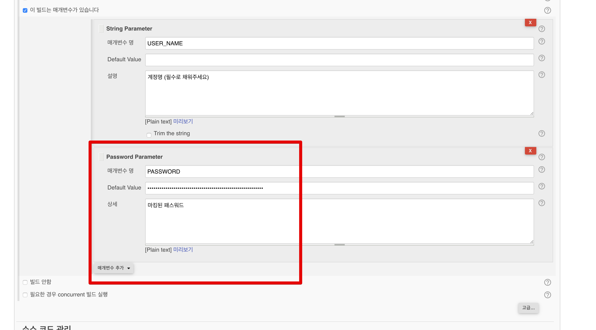

# 4. Ansible (앤서블) 로 전체 서버 사용자 추가하기 - Jenkins&Github 연동하기

이번 시간에는 앤서블로 전체 서버 사용자 추가하기 시리즈의 마지막! Jenkins&Github로 관리하기 입니다.  
  
그간 리눅스 서버의 터미널에서만 관리하던 앤서블을 개선해보겠습니다.  
  
이번 시간에 앞서 진행되야할 것들이 있습니다.  
  
일단 앤서블 호스트 서버에 젠킨스가 설치 되어 있어야 하며, 해당 젠킨스는 작성중인 앤서블 플레이북 코드가 담긴 깃허브 저장소와 연동되어 있는 상태여야 합니다.  
  
안되어 있으신 분들은 아래 링크를 참고하여 진행해주시면 됩니다.

* [젠킨스 설치](https://jojoldu.tistory.com/441)
* [젠킨스와 깃허브 프로젝트 연동](https://jojoldu.tistory.com/442)

## 1. Github 관리로 전환 

### 플레이북

EC2에서 실행중이던 플레이북 (site.yml) 을 Github 저장소에 등록합니다.

### 인벤토리

인벤토리 파일인 hosts는 Github으로 관리하지 않습니다.  
물론 사내 저장소를 쓰거나 Github의 private 저장소를 쓴다면 무방하지만, public 저장소를 쓴다면 IP나 다른 민감한 정보들이 공개되는거나 마찬가지입니다.  
그래서 별도로 

> **private 저장소**를 쓰신다면 Github에 인벤토리도 함께 올리셔도 괜찮습니다.

## 2. 젠킨스 설정

### 플러그인 설치

지금 다운로드하고 재시작 후 설치하기

메인페이지로 돌아가기

재시작 합니다.  

### 설정

## 플레이북 실행

