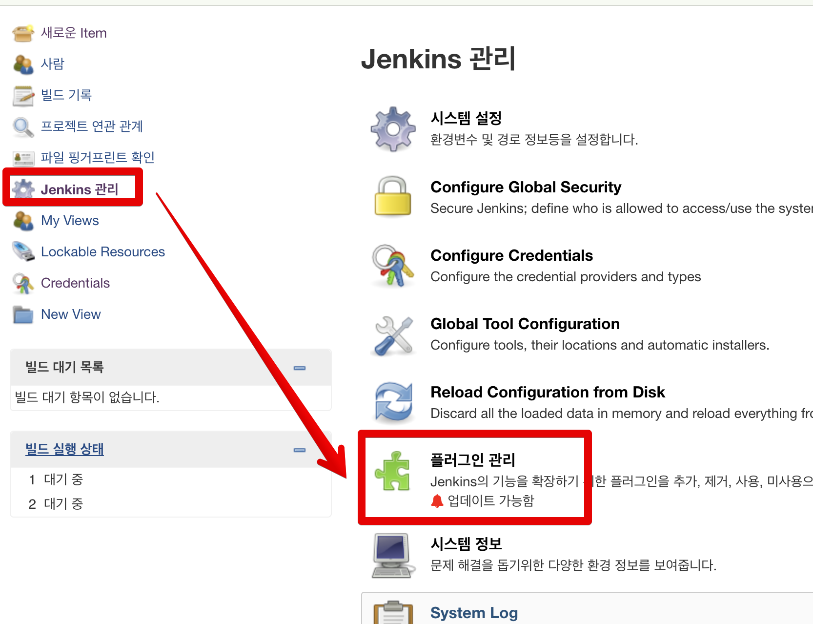
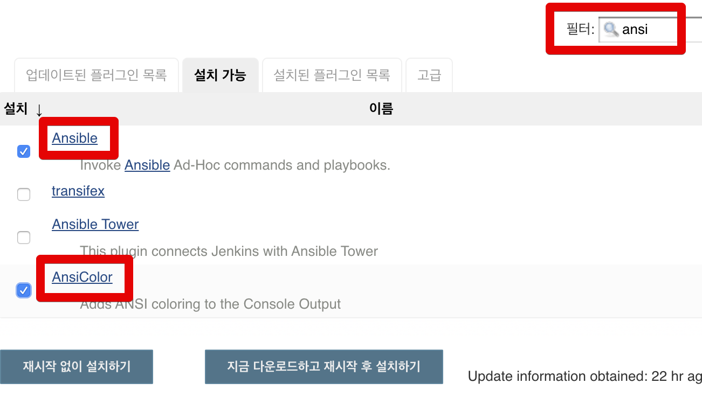
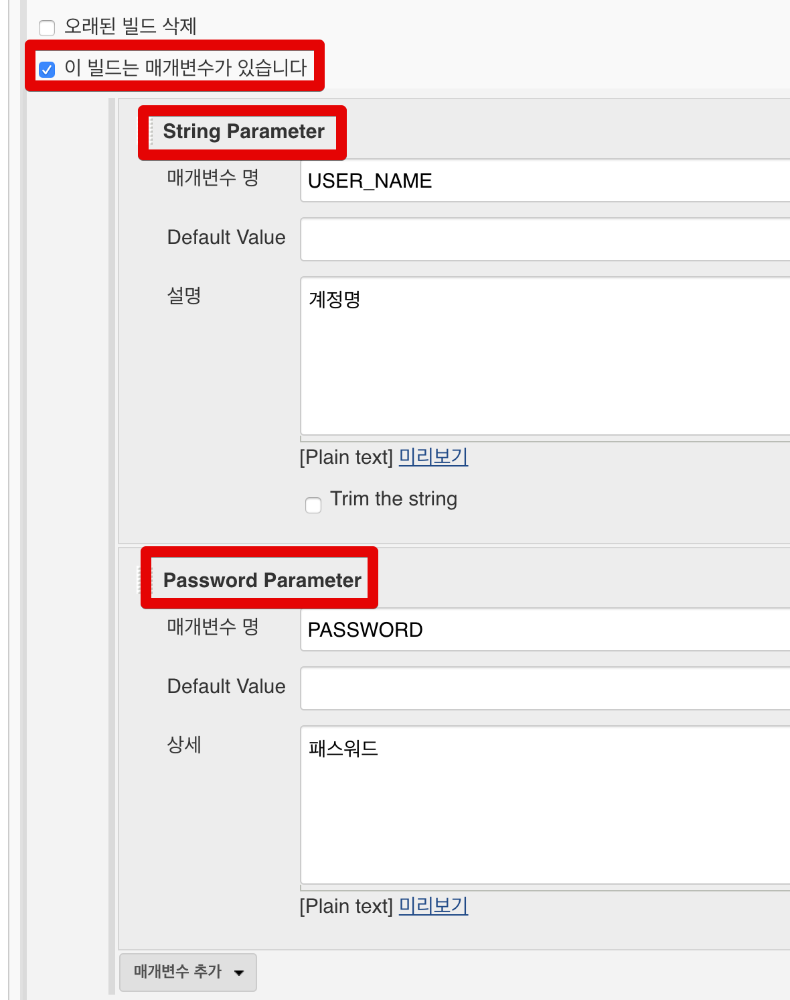

# 4. Ansible (앤서블) 로 전체 서버 사용자 추가하기 - Jenkins&Github 연동하기

이번 시간에는 앤서블로 전체 서버 사용자 추가하기 시리즈의 마지막! Jenkins&Github로 관리하기 입니다.  
  
그간 리눅스 서버의 터미널에서만 관리하던 앤서블을 개선해보겠습니다.  
  
이번 시간에 앞서 진행되야할 것들이 있습니다.  
  
일단 앤서블 호스트 서버에 젠킨스가 설치 되어 있어야 하며, 해당 젠킨스는 작성중인 앤서블 플레이북 코드가 담긴 깃허브 저장소와 연동되어 있는 상태여야 합니다.  
  
안되어 있으신 분들은 아래 링크를 참고하여 진행해주시면 됩니다.

* [젠킨스 설치](https://jojoldu.tistory.com/441)
* [젠킨스와 깃허브 프로젝트 연동](https://jojoldu.tistory.com/442)

환경 설정이 다 되신분들은 아래 내용을 차례로 진행합니다.

## 1. Github 관리로 전환

먼저 플레이북을 Github으로 관리할 수 있도록 이관하겠습니다.  
여기서는 플레이북 파일과 인벤토리 파일의 관리 방법을 다르게 진행합니다.

### 플레이북

3장에서 사용한 플레이북 (site.yml)을 Github 프로젝트에 복사합니다.  


코드 그대로 복사해서 만드시면 됩니다.  
꼭 저처럼 프로젝트 최상단에 위치하지 않아도 되며, 본인만의 하위 디렉토리를 만들어서 진행하셔도 무방합니다.

### 인벤토리

인벤토리 파일인 **hosts는 Github으로 관리하지 않겠습니다**.  
사내 저장소를 쓰거나 Github의 private 저장소를 쓴다면 Github으로 관리 합니다.  
다만 여기에서의 예제는 Github **public** 저장소를 기준으로 하기 때문에 **민감한 정보가 외부에 공개**될 수 있습니다.  
마찬가지로 이 예제를 진행하시는 분들도 정보 공개 위험이 있으니 안전하게 진행하겠습니다.  
  
인벤토리 파일은 **위치와 권한**을 수정합니다.  
  
먼저 파일을 다른 디렉토리로 복사하겠습니다.  
복사될 위치는 ```/var/lib/jenkins/ansible/useradd``` 입니다.  
이 위치는 **젠킨스가 실행되는 디렉토리** 입니다.  
결국 젠킨스가 앤서블을 실행해야하니, **젠킨스가 접근 가능한 디렉토리**에 관련된 파일들이 모두 위치하는게 좋습니다.  
  
해당 디렉토리는 현재 생성되어있지 않으니 차례로 생성합니다.

```bash
mkdir /var/lib/jenkins/ansible/
mkdir /var/lib/jenkins/ansible/useradd
```

그리고 hosts 파일을 복사합니다.

```bash
cp /root/ansible-useradd/hosts /var/lib/jenkins/ansible/useradd/
```

복사가 완료 되서 **디렉토리 이동 후** 파일을 확인해보면 권한이 **root**인것을 알 수 있습니다.


젠킨스의 서비스 실행자를 확인합니다.  
(대부분은 ```jenkins``` 입니다.)  


인벤토리 파일과 디렉토리 역시 젠킨스 사용자가 실행할 수 있게 사용자 권한을 ```jenkins``` 로 변경합니다.  

```bash
chown -R jenkins:jenkins ansible
chown jenkins:jenkins /var/lib/jenkins/ansible/useradd/hosts
```

사용자 권한도 변경이 잘 된 것을 확인할 수 있습니다.


Github의 설정이 모두 끝났으니 젠킨스 설정을 진행해보겠습니다.

## 2. 젠킨스 설정

젠킨스쪽은 작업할 것이 꽤 있습니다.  
차근차근 진행해보겠습니다.

### 2-1. 젠킨스 사용자 sudo 권한 추가

젠킨스가 결국 앤서블을 실행할 수 있어야 합니다.  
그럼 **비밀번호 입력 없이 sudo**를 실행할 수 있어야 합니다.  
아래와 같이 /etc/sudoers.d/jenkins 에 jenkins 사용자를 등록합니다.  

```bash
echo "jenkins ALL=(ALL) NOPASSWD:ALL" > /etc/sudoers.d/jenkins
```


그리고 tty 없이 sudo를 실행할 수 있도록 /etc/sudoers 파일을 수정합니다.

> 참고: [tty는 무엇인가요?](https://kldp.org/node/155210)

visudo를 입력하시면 /etc/sudoers 파일을 안전하게 편집할 수 있습니다.  
(```visudo```만 입력하셔야 합니다.)

```bash
visudo
```

아래와 같이 requiretty 항목이 있다면 주석 (```#```) 처리 합니다.

```bash
#Defaults requiretty # 주석
```

설정이 다 되셨다면 젠킨스에서 앤서블 명령어를 실행할 수 있는 준비가 되었습니다.

### 2-2. 플러그인 설치

젠킨스에서는 앤서블을 편하게 사용할 수 있도록 플러그인들을 제공합니다.  
해당 플러그인들을 설치하겠습니다.  
  
Jenkins 관리 -> 플러그인 관리로 이동합니다.



설치 가능 항목에서 [Ansible](https://wiki.jenkins.io/display/JENKINS/Ansible+Plugin) 과 [AnsiColor](https://wiki.jenkins.io/display/JENKINS/AnsiColor+Plugin) 플러그인을 검색하여 체크합니다.

* Ansible
  * 앤서블 실행에 필요한 여러 파라미터를 개별적으로 지정할 수 있는 플러그인
* AnsiColor
  * 출력 결과를 컬러가 있는 채로 나타낼 수 있는 플러그인



**지금 다운로드하고 재시작 후 설치하기** 를 클릭합니다.  
  
아래와 같이 플러그인 설치가 진행됩니다.


설치가 끝나고 설치된 플러그인 목록에 위 2개 플러그인이 존재하는지 확인합니다.


설치가 끝나셨다면 앤서블의 위치를 지정하겠습니다.  
(앤서블 위치를 모르면 젠킨스에서는 명령 수행이 안되니 필수 작업입니다.)  
  
먼저 젠킨스 서버에서 root 계정으로 설치한 앤서블 위치를 확인해봅니다.  

```bash
which ansible
```

아래와 같이 위치가 출력되면 ```ansible``` 빼고 복사해놓습니다.  
즉, 여기서는 ```/usr/local/bin/```까지만 복사합니다.


젠킨스의 Jenkins 관리 -> Global Tool Configuration 으로 이동합니다.


앤서블 플러그인이 설치되어있다면 아래와 같이 Ansible 설치 위치를 등록할 수 있는 항목을 볼 수 있습니다.  
여기서 Path에 복사한 **앤서블 디렉토리**를 등록합니다.


(ansible이 빠지고 디렉토리인 bin까지만 되있는걸 꼭 확인하셔야 합니다.)  
  
앤서블 명령어는 ansible만 있지 않고, ansible-playbook 등과 같이 여러 명령어들이 있습니다.  
이들을 다 포함시키기 위해 디렉토리를 지정하는 것이니 꼭 디렉토리만 넣으셔야 합니다.  
  
Name은 본인이 원하는 앤서블 이름을 넣으면 됩니다.  
저는 버전을 알 수 있게 버전까지 등록했습니다.  

### 2-3. 젠킨스 Job 설정

모든 플러그인 설정이 끝났다면 이제 젠킨스 Job을 생성합니다.  
Freestyle project를 선택해서 개설합니다.


매개변수에는 아래 2개가 필요합니다.  
String Parameter, Password Parameter.  



* String Parameter
  * 일반적인 문자열 파라미터입니다.
  * 사용자명과 같이 노출이 되어도 무방한 정보에 사용됩니다.
* Password Parameter
  * **마스킹**된 파라미터 입니다.
  * 비밀번호의 경우 젠킨스 이력에도 남기면 안되니 이력, 콘솔에서도 확인할 수 없게 사용합니다.

앤서블 파일들이 있는 깃헙 저장소와 연동 합니다.  


빌드환경에서는 컬러풀한 콘솔을 위해 ANSI Console을 체크합니다.


Invoke Ansible Playbook 을 선택하여 아래와 같이 본인 환경에 맞게 등록합니다.


* Ansible installation
  * 
* Playbook path
  * 깃헙으로 코드가 관리되고 있으니 상대 경로로 지정합니다.
  * 어느 Job에서 실행되는지 관계 없이 해당 깃헙 연동만 되면 사용할 수 있게 됩니다.
* Inventory
  * File or host list
    * 파일 경로를 지정합니다.
    * 젠킨스 서버에 둔 hosts 파일 위치를 사용합니다.

Build의 **고급** 버튼을 눌러 다음과 같이 젠킨스 파라미터 변수를 등록합니다.  
이는 **젠킨스의 파라미터를 플레이북 파라미터로 전달** 하는 설정입니다.


설정이 다 되었으니 이제 실행 해보겠습니다.

## 3. 젠킨스로 플레이북 실행하기

방금 만든 젠킨스 Job을 테스트용 계정과 비밀번호를 입력해서 실행해봅니다.


현재 상태에서 실행하면 다음과 같은 에러가 발생합니다.


자 이제 실행 에러를 하나씩 고쳐보겠습니다.

### 3-1. known_host 등록

위 에러는 [1장](https://jojoldu.tistory.com/432)에서 발생한 에러와 동일한 이유입니다.  
known_host 로 등록이 안되어있기 때문인데요.  
1장에서 해결한 방법은 **root계정으로 실행**한것이라 그 외 나머지 계정들은 동일하게 아직 known_host가 생성되지 않은 상태입니다.  
현재 젠킨스는 jenkins 계정으로 앤서블 명령어를 수행하니 jenkins 계정으로도 known_host 등록을 해보겠습니다.  
먼저 젠킨스 서버 터미널로 접속하여 현재 사용자를 jenkins로 전환합니다.

```bash
sudo -u jenkins /bin/bash
```

그리고 간단한 ping 명령어를 수행해 호스트 등록을 진행합니다.

```bash
/usr/local/bin/ansible all -m ping -i /var/lib/jenkins/ansible/useradd/hosts
```


yes/no? 질문에 모두 yes를 입력합니다.  
현재 테스트에선 2대의 호스트 주소가 필요하니 2번 yes를 입력합니다.  
  
### 3-2. 호스트 서버에 id_rsa.pub 등록


[1장](https://jojoldu.tistory.com/432)에서 진행한대로 jenkins 사용자의 공개키를 생성합니다.  

```bash
cd .ssh
pwd
```

```bash
/var/lib/jenkins/.ssh
```

```bash
ssh-keygen -t rsa
```

```bash
chmod 600 id_rsa
chmod 644 id_rsa.pub
```


## 4. 젠킨스 장점

마지막으로 **앤서블을 젠킨스와 연동하는 것의 장점**을 소개드리겠습니다.  
꼭 젠킨스여야 하는것은 아니지만, 젠킨스와 같은 CI/CD 도구를 이용해 앤서블을 사용하는것의 장점이라고 보시면 됩니다.

* 플레이 북 실행과 관련된 대부분의 복잡성은 Jenkins 양식과 Execute Shell로 코딩 할 수 있습니다. 
  * 이를 통해 Ansible에 대한 경험이 거의 또는 전혀없는 운영 직원이 플레이 북을 실행할 수 있습니다.
* Jenkins 빌드 로그는 특정 환경에 적용한 변경 사항을 추적하고 감사 할 수있는 훌륭한 리소스입니다.
* Jenkins는 플레이 북 구성에 도움이되는 작업, 탭보기를 그룹화 할 수있는 훌륭한 인터페이스를 제공합니다. 
* Jenkins를 사용하면 동일한 양식 인터페이스에서 작업 및 매개 변수를 문서화 할 수 있습니다. 
  * 위키에서 해당 정보를 찾는 것보다 양식 자체의 문서를 참조하는 것이 더 편리합니다.
* 과거 빌드 데이터
  * Jenkins는 모든 배포 기록을 저장합니다. 
  * 배포가 실패하면 상황이 언제 언제 발생했는지 정확히 알 수 있습니다. 
  * Jenkins는 콘솔 출력 탭에서 발생한 모든 것을 기록합니다.
* 비 서버 관리자 권한 부여
  * Jenkins 사용자는 Jenkins에 로그인하여 버튼을 눌러 수동 배포 또는 작업을 시작할 수 있습니다. 
  * ssh를 통해 로그인하는 방법이나 명령 줄에서 단일 명령을 실행하는 방법을 몰라도됩니다.
* 일관된 워크 플로 시행
  * Jenkins를 사용하여 코드를 배포하면 일관된 워크 플로가 적용됩니다. 
  * 이 예에서 drush는 모든 단일 배포에서 기능을 되돌립니다. 
  * 이는 개발자가 게으르지 않고 프로덕션 환경에서 전환 할 수 있음을 의미합니다. 다음 배포에서 이러한 변경 사항이 손실됩니다!
* 프로젝트 전반의 상태 표시기
  * Jenkins 대시 보드에는 모든 작업에 대한 간략한 개요가 표시됩니다. 
  * 마지막 빌드 상태, 마지막 몇 빌드의 집계 된 "날씨 보고서", 마지막 빌드 기간 등이 있습니다. 
* 슬랙 통합
  * 작업을 쉽게 구성하여 슬랙으로 상태를 다시보고 할 수 있습니다.
  * 빌드가 시작될 때와 성공 또는 실패 할 때 각 프로젝트 채널에보고하도록 설정했습니다. 
  * 프로젝트의 모든 사람에게 뛰어난 가시성.

